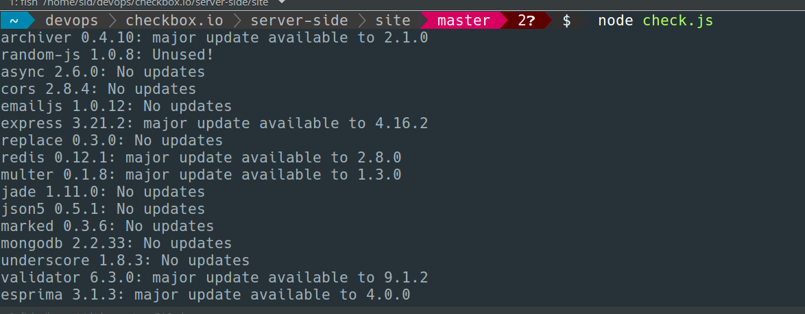
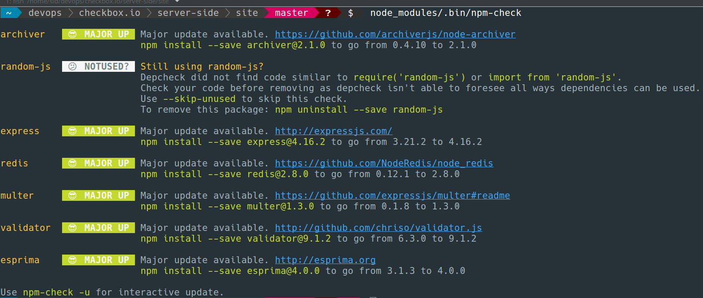

csc_519_devops
Repo for CSC 519 - DevOps

# Special Milestone
[Screencast](https://youtu.be/o3Cof-OY8tY)

We are integrating our special milestone work with the Checkbox server that we deployed on this CI/CD pipeline project.

The idea of our special milestone is to build a UI portal which displays/consists the following to the user :-

+ Dependency Checker (Health check)
  - Most of the build failures happen due to failure of dependency checks. Thus, we thought it is an important parameter to consider and user can know when dependency checks fail, and rectify code to prevent build failure.

+ Usage Statistic (Graph) 
  - This will monitor CPU/Memory usage and plot a graph

+ Network Stats 
  - This functionality does port scanning on the server that is hosting the application. It displays the ports that are currently open and also the processes that are using them. 
  - It helps the user know which all ports are in use. This could help a developer to monitor the ports and enhance security by closing unwanted ports and processes.

+ Flame Graph 
  - Flame graphs are system profile visualisation software.
  - Flame graphs internally use kernel tools such as perf. 
  - Flame graphs can accurately provide CPU profiling as compared to other profilin methods such as java profilers becasue they also capture system calls and kernel stacks
  - We have demostrated a flame graph to display the CPU statistics of the server that hosts checkbox.io
  - The gathering are displayed on the server dashboard letting the user collect data about system performance.
  - We have added flame graph to our UI which will help in . 

## Implementation - Flame Graph
1. We have used the flame graph repository and linux perf tool to generate flame graphs.
2. We are using perf record and perf script to collect CPU data
3. To automate the process we have used a shell script to collect CPU data 
4. While the flame graph is collecting data we are hitting API's of checkbox.io using anothe script.
5. We record how the system performance is effected when we continuously hit the API of the application

## Implementation - Monitoring Dashboard 

### Dependency Checker

To implement this function we are using the 'npm-check' npm module and using a Node.js script to implement this function - [check.js](https://github.ncsu.edu/zsthampi/csc_519_devops/blob/milestone4/check.js).

It checks if all the modules/packages needed (dependencies) have been installed and latest or not.
We are using the earlier mentioned script and the UI uses that to display details of dependency checking.

Steps to run the dependency checker separately -
- `git clone git@github.com:thegreyd/checkbox.io.git`
- `cd checkbox.io/server-side/site`
- `npm install`
- `node check.js`




### Usage Statistics

To implement this feature we have used the 'express-ping' npm module. Using the 'express-ping' module, we can expose a simple API (route) to see health status of our application, so we are creating a route to display the parameters. We have integrated our code for this in the server.js of Checkbox server-side code and this provides us with an end-point - http://host:3000/ping where we get all the required parameters. 
Only main addition required was - 
```
app.use(health.ping());
``` 

Now, we did not need all the parameters and information, so we extracted the important ones and plot a graph to be displayed on our UI portal.

For usage statistics we have plotted garphs of CPU usage and Memory usage against time. 

### Network Statistics - Port Scanning

We have used a python script - [port.py](https://github.ncsu.edu/zsthampi/csc_519_devops/blob/milestone4/port.py) to implement this functionality. The script lists down all the open/listening ports and lists down the processes using them. This is helpful when we have to choose a port for another application/process. This is also integrated with back-end UI code and our UI displays this. 
