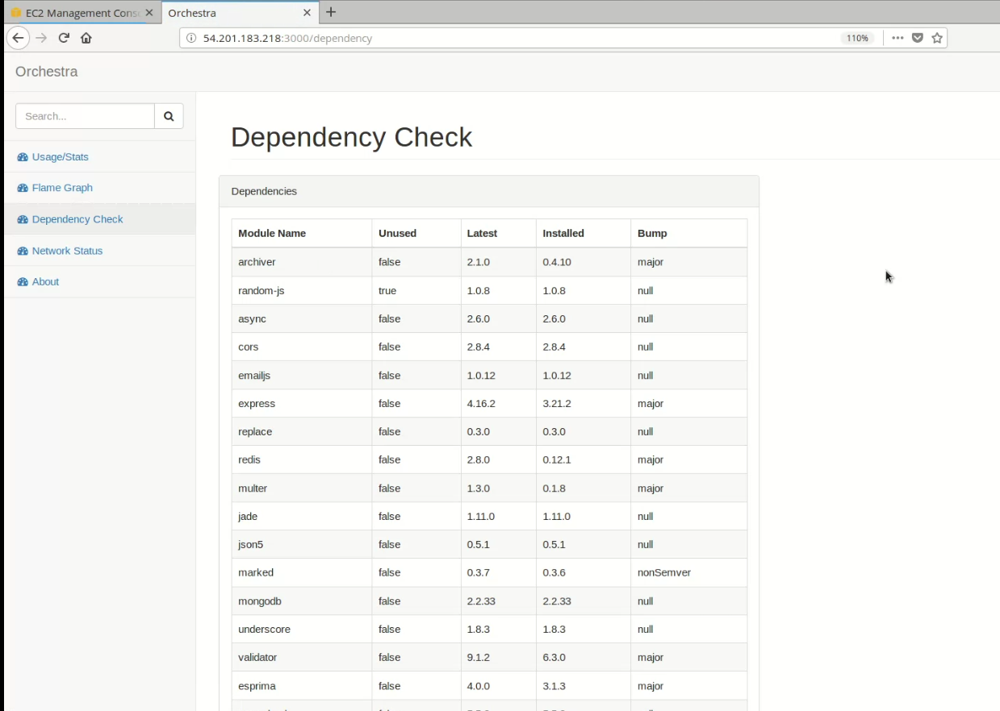
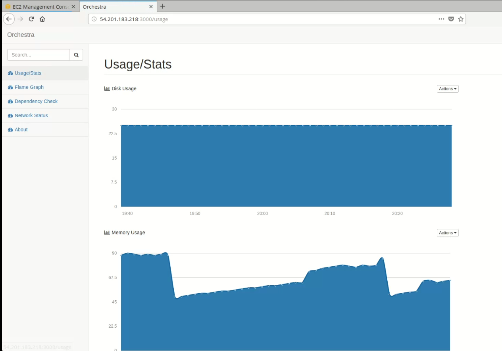
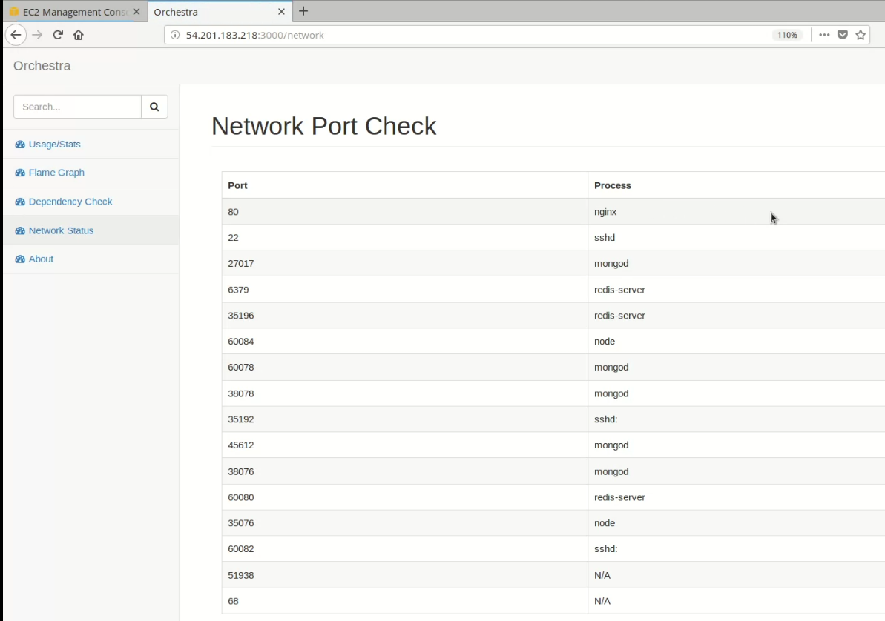
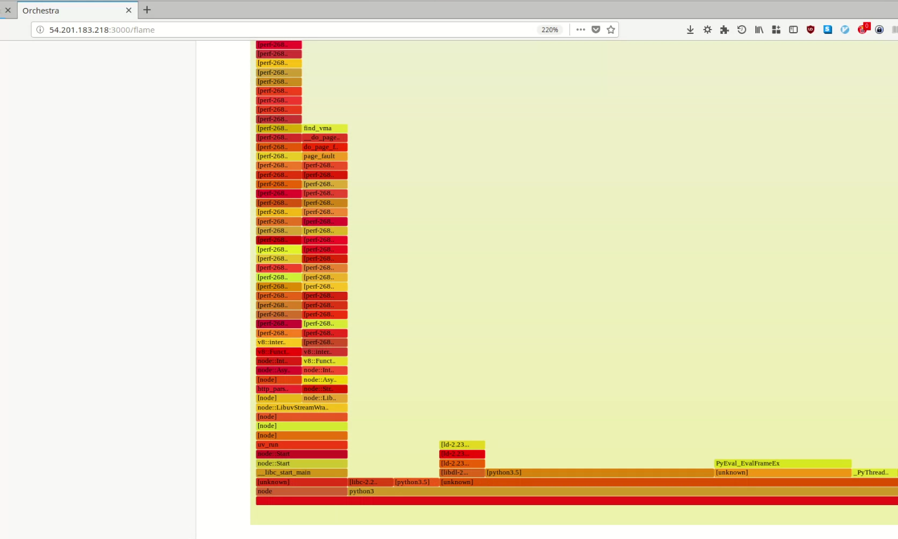
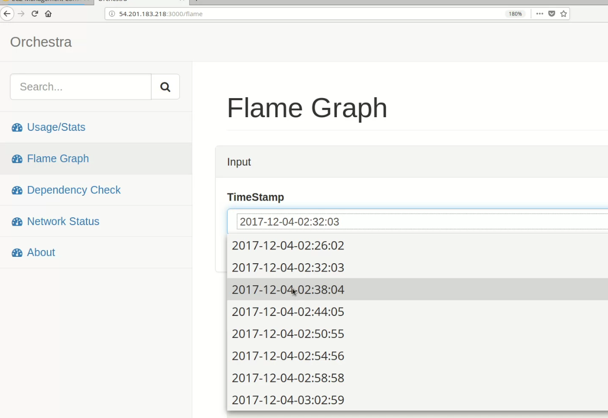

csc_519_devops
Repo for CSC 519 - DevOps

# Special Milestone
[Pipeline Overview](https://youtu.be/gSkJ5s8-AL0)
[Screencast](https://youtu.be/o3Cof-OY8tY)

We are integrating our special milestone work with the Checkbox server that we deployed on this CI/CD pipeline project.

We built a dashboard which displays the following views to the user :

## Dependency Checker

Dependencies are important as they increase the attack surface of your application. Any security vulnerability in 3rd party npm module, can severely affect your application. Therefore it is important to update your dependencies to the latest version. We show the severity of updates [major, minor, bugfix], to let you make the decision.

## Usage Statistics 

This will monitor CPU/Memory/Disk usage and plot a graph, to easily show spikes or unusual trends.

## Network Stats 

This functionality does port scanning on the server that is hosting the application. It displays the ports that are currently open and also the processes/services that are using them. 

This helps the development team to monitor the services and ports and enhance security by closing unwanted ports and processes.

## Flame Graph 

- Flame graphs are system profile visualization software.
- Flame graphs internally use kernel tools such as perf. 
- Flame graphs can accurately provide CPU profiling as compared to other profiling methods such as java profilers because they also capture system calls and kernel stacks
- We have a flame graph to display the CPU statistics of the server that hosts checkbox.io

## Implementation Details

### Flame Graph

- We have used the flame graph repository and linux perf tool to generate flame graphs.
- We are using perf record and perf script to collect CPU data
- To automate the process we have used a shell script to collect CPU data 
- While the flame graph is collecting data we are hitting API's of checkbox.io using anothe script.
- We record how the system performance is effected when we continuously hit the API of the application

### Dependency Checker

To implement this function we are using the 'npm-check' npm module. Using the this module, we exposed an endpoint that returns dependencies information.http://host:3000/pingdependency where we get all the required parameters in json format.

It detects these about the dependencies:
- unused dependencies
- any version updates on npm
- included in package.json or not

### Usage Statistics

To implement this feature we have used the 'express-ping' npm module. Using the 'express-ping' module, we can expose a simple API (route) to see health status of our application, so we are creating a route to display the parameters. We have integrated our code for this in the server.js of Checkbox server-side code and this provides us with an end-point - http://host:3000/ping where we get all the required parameters. 
Only main addition required was - 

`app.use(health.ping());`

Now, we did not need all the parameters and information, so we extracted the important ones and plot a graph to be displayed on our UI portal.

For usage statistics we have plotted garphs of CPU usage and Memory usage against time. 

### Network Statistics - Port Scanning

We have used a python script - [port.py](https://github.ncsu.edu/zsthampi/csc_519_devops/blob/milestone4/port.py) to implement this functionality. The script lists down all the open/listening ports and lists down the processes using them. This is helpful when we have to choose a port for another application/process. This is also integrated with back-end UI code and our UI displays this. 
